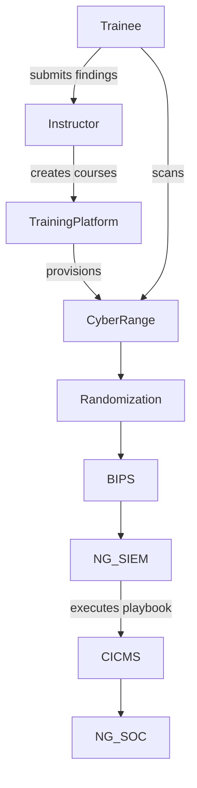

# Subcase 1b Guide: Penetration Testing and Vulnerability Assessment

## Objective
Provide self-paced training on penetration testing and vulnerability assessments. The Training Instructor creates courses and configures Cyber Range scenarios simulating CYNET's network infrastructure. Trainees run semi-automated penetration tests to locate potential vulnerabilities and attack entry points.

## Workflow Diagram



## Instructor Steps

1. **Start the Cyber Range**
   ```bash
   sudo subcase_1b/scripts/cyber_range_start.sh
   ```
   Initializes the simulated CYNET network environment.
2. **Launch the Training Platform**
   ```bash
   sudo subcase_1b/scripts/training_platform_start.sh --course pentest-101
   ```
   Starts the Flask service, registers the instructor, and creates the course via the REST API.

   To invite a learner:
   ```bash
   TOKEN=$(python subcase_1b/training_platform/cli.py login --username instructor --password changeme)
   COURSE_ID=$(python subcase_1b/training_platform/cli.py list-courses --token "$TOKEN" | python -c 'import sys,json; d=json.load(sys.stdin); print(next(iter(d.keys())))')
   python subcase_1b/training_platform/cli.py invite --token "$TOKEN" --course-id "$COURSE_ID" --email learner@example.com
   ```
3. **Initialize Security Pipeline**
   - Start Randomization Evaluation Platform
     ```bash
     sudo subcase_1b/scripts/randomization_platform_start.sh
     ```
   - Start BIPS
     ```bash
     sudo subcase_1b/scripts/bips_start.sh
     ```
   - Start NG-SIEM and process attachments
    ```bash
    sudo subcase_1b/scripts/ng_siem_start.sh
    ```
    Starts an ingestion service for trainee scan results, registers any attachments,
    executes the CA/CND Playbook through the CA Module for Integration, and stores results in MongoDB.
   - Start CICMS
     ```bash
     sudo subcase_1b/scripts/cicms_start.sh
     ```
   - Start NG-SOC
     ```bash
     sudo subcase_1b/scripts/ng_soc_start.sh
     ```
4. **Review Trainee Reports** – Evaluate submitted findings from penetration test runs.

## Trainee Steps

1. Log in to the trainee workstation.
2. Retrieve course material from the training platform.
3. Run the semi-automated scan.
   ```bash
   sudo subcase_1b/scripts/trainee_start.sh --target 10.10.0.4
   ```
   The script employs `rustscan` instead of `nmap`, sends the scan output to the NG-SIEM ingestion endpoint, and reports completion back to the training platform.
4. Document discovered vulnerabilities and provide them to the instructor.

## Phishing Awareness Quiz

The training platform includes a short phishing quiz to reinforce social engineering concepts. Trainees can use the following REST endpoints once authenticated:

- **Start quiz**
  ```bash
  curl "http://localhost:5000/quiz/start?token=$TOKEN&course_id=$COURSE_ID"
  ```
- **Submit answers**
  ```bash
  curl -X POST http://localhost:5000/quiz/submit -H 'Content-Type: application/json' \
       -d '{"token":"'$TOKEN'","course_id":"'$COURSE_ID'","answers":{"q1":0,"q2":1}}'
  ```
- **Retrieve score**
  ```bash
  curl "http://localhost:5000/quiz/score?token=$TOKEN&course_id=$COURSE_ID"
  ```

Scores are stored per user and course so progress can be tracked over time.

## Evaluation Flow

Trainee actions within the Cyber Range can be submitted back to the
training platform using the `POST /results` endpoint. The endpoint
calculates basic metrics such as quiz score and time spent on an
exercise and writes them to `results.json`. An internal progress value
is updated and forwarded to the Open edX `/courseware/` API so that the
learner's status is reflected in the LMS.

```bash
curl -X POST http://localhost:5000/results \
     -H 'Content-Type: application/json' \
     -d '{"token":"'$TOKEN'","course_id":"'$COURSE_ID'","score":2,"start_time":0,"end_time":42}'
```

The recorded metrics allow instructors to review completion times and
quiz performance when assessing learner progress.

## KYPO Lab Integration

The training platform can launch [KYPO](https://www.kypo.muni.cz/) labs
using the LTI 1.3 protocol. Configure the following environment
variables before starting the platform so that launch URLs can be
generated:

| Variable | Description |
| -------- | ----------- |
| `KYPO_URL` | Base URL of the KYPO LTI provider (default `http://localhost:5000`). |
| `LTI_CLIENT_ID` | Client identifier issued by KYPO. |
| `LTI_DEPLOYMENT_ID` | Deployment identifier for the integration. |
| `LTI_TOOL_PRIVATE_KEY` | RSA private key used to sign LTI launch tokens. It may contain the key itself or a path to a key file. |

When Open edX needs to start a KYPO session it should call the new
endpoint on the training platform:

```bash
curl -X POST http://localhost:5000/kypo/launch \
     -H 'Content-Type: application/json' \
     -d '{"token":"'$TOKEN'","lab_id":"intro-lab"}'
```

The response contains a pre-signed URL in the `launch_url` field. The
LMS should redirect the learner’s browser to that URL to open the lab.

### Creating an LTI component in Open edX

1. In *Studio*, open the course and navigate to **Settings → Advanced
   Settings**. Add `"lti_consumer"` to the *Advanced Module List* and
   save.
2. In the unit where the lab should appear, add a new **LTI
   consumer** component.
3. Set **LTI URL** to the training platform endpoint
   `http://localhost:5000/kypo/launch` (replace host if the platform
   runs elsewhere).
4. In **Custom Parameters** specify the target lab, e.g.
   `lab_id=intro-lab`. The component will POST this value together with
   the learner’s authentication token when rendering the unit.
5. Mark the component as **graded** if the KYPO exercise should
   contribute to the course score and assign an appropriate weight.

> **Deployment note:** After enabling `lti_consumer`, instructors should
> preview the unit in Studio to confirm the integration. Clicking the
> **Launch KYPO Lab** button should call the training platform’s
> `/kypo/launch` endpoint and redirect the browser to the KYPO lab. If
> no redirect occurs, verify that the training platform is running and
> that the lab identifier matches an available exercise.

When a learner accesses the unit, Open edX posts the parameters to the
training platform. The platform validates the token, generates a signed
LTI launch URL, and returns it to the LMS which then redirects the
learner into the KYPO lab.

### Mapping KYPO results to Open edX grading

KYPO activities report completion data back to the training platform via
the `/listener` endpoint. The platform aggregates submitted `score` and
`flag` values and forwards the metrics to Open edX using the
`/courseware/progress` API. The LTI component’s weight determines how
these metrics influence the final grade. Instructors can review the raw
aggregated data with the `/results` endpoint to understand the learner’s
performance and adjust grading policies as needed.

## Expected Outcomes

- Course creation logs at `/var/log/training_platform/courses.log`.
- Cyber Range initialization logs at `/var/log/cyber_range/launch.log`.
- Trainee scan results at `/var/log/trainee/scans.log` and progress stored in the training platform.
- Scan documents stored in MongoDB collection `scans` for later analysis.

## References

- [`training_platform_start.sh`](../subcase_1b/scripts/training_platform_start.sh)
- [`trainee_start.sh`](../subcase_1b/scripts/trainee_start.sh)
- [`cyber_range_start.sh`](../subcase_1b/scripts/cyber_range_start.sh)
- [`randomization_platform_start.sh`](../subcase_1b/scripts/randomization_platform_start.sh)
- [`bips_start.sh`](../subcase_1b/scripts/bips_start.sh)
- [`ng_siem_start.sh`](../subcase_1b/scripts/ng_siem_start.sh)
- [`ng_siem/app.py`](../subcase_1b/ng_siem/app.py)
- [`cicms_start.sh`](../subcase_1b/scripts/cicms_start.sh)
- [`ng_soc_start.sh`](../subcase_1b/scripts/ng_soc_start.sh)
