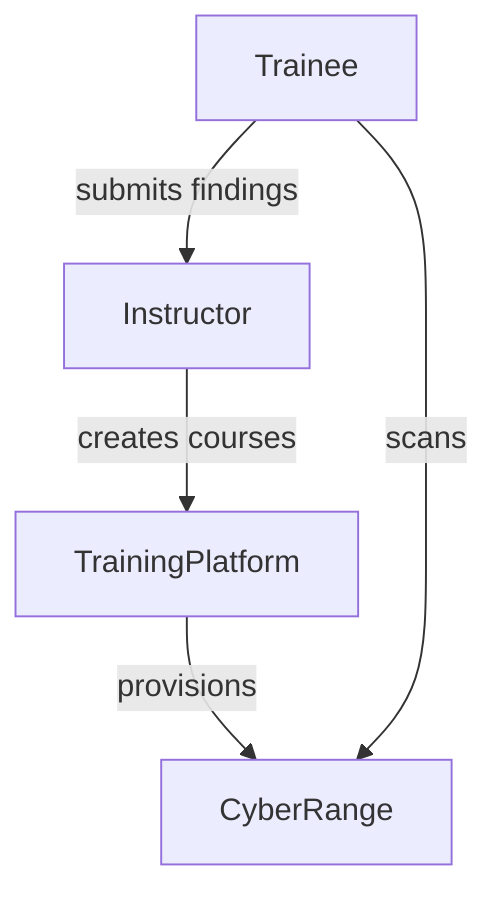

# Subcase 1b Guide: Penetration Testing and Vulnerability Assessment

## Objective
Provide self-paced training on penetration testing and vulnerability assessments. The Training Instructor creates courses and configures Cyber Range scenarios simulating CYNET's network infrastructure. Trainees run semi-automated penetration tests to locate potential vulnerabilities and attack entry points.

## Workflow Diagram



## Instructor Steps

1. **Start the Cyber Range**
   ```bash
   sudo subcase_1b/scripts/cyber_range_start.sh
   ```
   Initializes the simulated CYNET network environment.
2. **Launch the Training Platform**
   ```bash
   sudo subcase_1b/scripts/training_platform_start.sh --course pentest-101
   ```
   Creates the self-paced course and prepares related scenarios.
3. **Review Trainee Reports** – Evaluate submitted findings from penetration test runs.

## Trainee Steps

1. Log in to the trainee workstation.
2. Retrieve course material from the training platform.
3. Run the semi-automated scan.
   ```bash
   sudo subcase_1b/scripts/trainee_start.sh --target 10.10.0.4
   ```
4. Document discovered vulnerabilities and provide them to the instructor.

## Expected Outcomes

- Course creation logs at `/var/log/training_platform/courses.log`.
- Cyber Range initialization logs at `/var/log/cyber_range/launch.log`.
- Trainee scan results at `/var/log/trainee/scans.log`.

## References

- [`training_platform_start.sh`](../subcase_1b/scripts/training_platform_start.sh)
- [`trainee_start.sh`](../subcase_1b/scripts/trainee_start.sh)
- [`cyber_range_start.sh`](../subcase_1b/scripts/cyber_range_start.sh)
