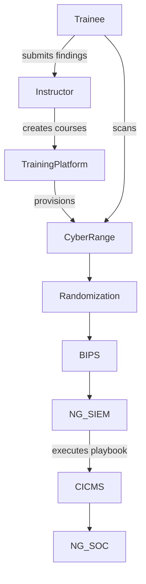

# Subcase 1b Guide: Penetration Testing and Vulnerability Assessment

## Objective
Provide self-paced training on penetration testing and vulnerability assessments. The Training Instructor creates courses and configures Cyber Range scenarios simulating CYNET's network infrastructure. Trainees run semi-automated penetration tests to locate potential vulnerabilities and attack entry points.

## Workflow Diagram



## Instructor Steps

1. **Start the Cyber Range**
   ```bash
   sudo subcase_1b/scripts/cyber_range_start.sh
   ```
   Initializes the simulated CYNET network environment.
2. **Launch the Training Platform**
   ```bash
   sudo subcase_1b/scripts/training_platform_start.sh --course pentest-101
   ```
   Starts the Flask service, registers the instructor, and creates the course via the REST API.

   To invite a learner:
   ```bash
   TOKEN=$(python subcase_1b/training_platform/cli.py login --username instructor --password changeme)
   COURSE_ID=$(python subcase_1b/training_platform/cli.py list-courses --token "$TOKEN" | python -c 'import sys,json; d=json.load(sys.stdin); print(next(iter(d.keys())))')
   python subcase_1b/training_platform/cli.py invite --token "$TOKEN" --course-id "$COURSE_ID" --email learner@example.com
   ```
3. **Initialize Security Pipeline**
   - Start Randomization Evaluation Platform
     ```bash
     sudo subcase_1b/scripts/randomization_platform_start.sh
     ```
   - Start BIPS
     ```bash
     sudo subcase_1b/scripts/bips_start.sh
     ```
   - Start NG-SIEM and process attachments
    ```bash
    sudo subcase_1b/scripts/ng_siem_start.sh
    ```
    Starts an ingestion service for trainee scan results, registers any attachments,
    executes the CA/CND Playbook through the CA Module for Integration, and stores results in MongoDB.
   - Start CICMS
     ```bash
     sudo subcase_1b/scripts/cicms_start.sh
     ```
   - Start NG-SOC
     ```bash
     sudo subcase_1b/scripts/ng_soc_start.sh
     ```
4. **Review Trainee Reports** – Evaluate submitted findings from penetration test runs.

## Trainee Steps

1. Log in to the trainee workstation.
2. Retrieve course material from the training platform.
3. Run the semi-automated scan.
   ```bash
   sudo subcase_1b/scripts/trainee_start.sh --target 10.10.0.4
   ```
   The script employs `rustscan` instead of `nmap`, sends the scan output to the NG-SIEM ingestion endpoint, and reports completion back to the training platform.
4. Document discovered vulnerabilities and provide them to the instructor.

## Expected Outcomes

- Course creation logs at `/var/log/training_platform/courses.log`.
- Cyber Range initialization logs at `/var/log/cyber_range/launch.log`.
- Trainee scan results at `/var/log/trainee/scans.log` and progress stored in the training platform.
- Scan documents stored in MongoDB collection `scans` for later analysis.

## References

- [`training_platform_start.sh`](../subcase_1b/scripts/training_platform_start.sh)
- [`trainee_start.sh`](../subcase_1b/scripts/trainee_start.sh)
- [`cyber_range_start.sh`](../subcase_1b/scripts/cyber_range_start.sh)
- [`randomization_platform_start.sh`](../subcase_1b/scripts/randomization_platform_start.sh)
- [`bips_start.sh`](../subcase_1b/scripts/bips_start.sh)
- [`ng_siem_start.sh`](../subcase_1b/scripts/ng_siem_start.sh)
- [`ng_siem/app.py`](../subcase_1b/ng_siem/app.py)
- [`cicms_start.sh`](../subcase_1b/scripts/cicms_start.sh)
- [`ng_soc_start.sh`](../subcase_1b/scripts/ng_soc_start.sh)
