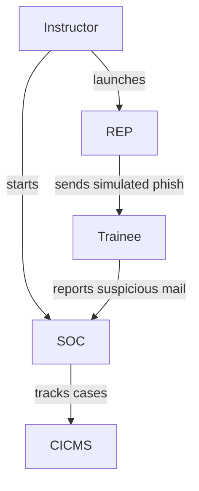

# Subcase 1b Guide: Phishing-Awareness Training

## Objective
Provide phishing-awareness training with an accompanying policy briefing. Trainees practice spotting and reporting malicious messages inside the Random Education Platform (REP) while SOC analysts monitor activity through NG‑SOC components.

## Workflow Diagram



## Instructor Steps

1. **Start SOC services**
   ```bash
   sudo subcase_1b/scripts/soc_server_start.sh
   ```
   Launches BIPS, NG-SIEM, CICMS, and NG-SOC.
2. **Launch the Random Education Platform (REP)**
   ```bash
   sudo subcase_1b/scripts/training_platform_start.sh
   ```
   Sends simulated phishing emails for trainees to classify and review against the policy briefing.
3. **Debrief** – Monitor alerts in NG-SOC tools and discuss findings with trainees.

## Trainee Steps

1. Log in to the trainee workstation.
2. Review the security policy in REP.
3. Inspect the mailbox for simulated phishing messages.
4. Report any suspicious emails through REP.
5. Confirm completion with the instructor.

## Expected Outcomes

- REP writes a phishing log to `/var/log/training_platform/phishing.log`.
- Trainee mailbox updated at `/var/mail/trainee`.
- BIPS (5500), NG-SIEM (5601), CICMS (5800), and NG-SOC (5900) running.

## References

- [`training_platform_start.sh`](../subcase_1b/scripts/training_platform_start.sh)
- [`trainee_start.sh`](../subcase_1b/scripts/trainee_start.sh)
- [`soc_server_start.sh`](../subcase_1b/scripts/soc_server_start.sh)

